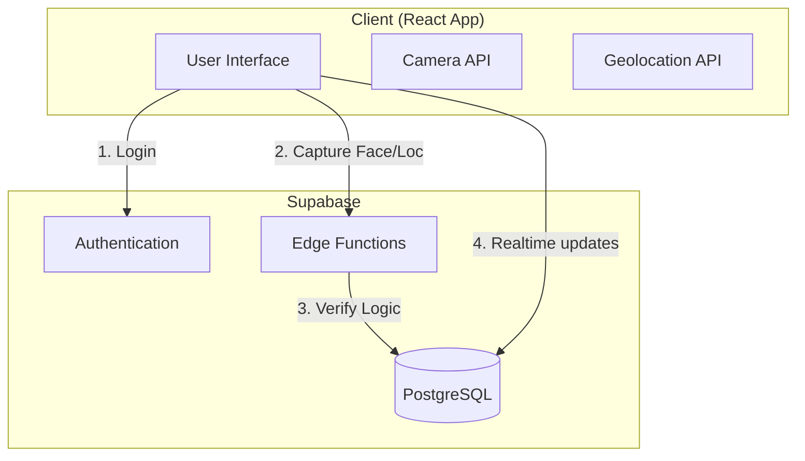
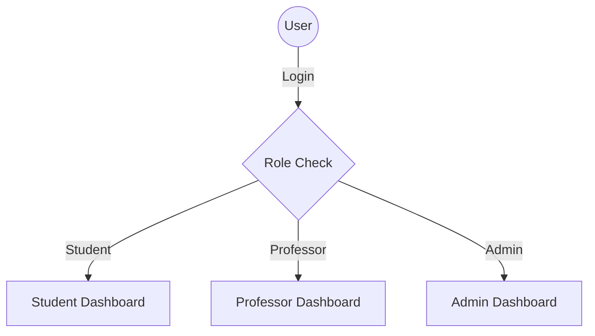

# AttendEase - Intelligent Attendance Management System

AttendEase is a modern, AI-powered attendance tracking application designed to streamline the process for students, professors, and administrators. It leverages facial recognition, geolocation, and QR codes to ensure secure and efficient attendance verification.

## 🚀 Features

### 🎓 Student Portal
*   **Multi-Method Check-in**:
    *   **Face Verification**: AI-based biometric verification using face embeddings.
    *   **QR Code**: Dynamic QR scanning for validation.
    *   **GPS Proximity**: Location-based checks to ensure students are physically in the classroom.
*   **Real-time Dashboard**: View active sessions and attendance stats.
*   **History & Reports**: Track attendance records and percentage per subject.
*   **Timetable**: digital class schedule view.

### 👨‍🏫 Professor Portal
*   **Session Management**: Create and manage live Class Sessions.
*   **Live Monitoring**: Watch attendance updates in real-time as students check in.
*   **Dynamic QR Generation**: Secure, time-limited QR codes for checking in.
*   **Reports**: Export detailed attendance reports (CSV/PDF) for administrative use.

### 🛡️ Admin Portal
*   **User Management**: centralized control over Student and Faculty accounts.
*   **Academic Structure**: Manage Departments, Classes, and Course mappings.
*   **Analytics**: System-wide insights on attendance trends and anomalies.

---

## 🛠️ Technology Stack

**Frontend**
*   **Framework**: [React](https://react.dev/) + [Vite](https://vitejs.dev/)
*   **Language**: [TypeScript](https://www.typescriptlang.org/)
*   **Styling**: [Tailwind CSS](https://tailwindcss.com/) + [shadcn/ui](https://ui.shadcn.com/)
*   **State/Query**: [TanStack Query](https://tanstack.com/query/latest)
*   **Routing**: [React Router](https://reactrouter.com/)

**Backend & Services**
*   **Platform**: [Supabase](https://supabase.com/) (BaaS)
*   **Database**: PostgreSQL
*   **Auth**: Supabase Auth (JWT based)
*   **Compute**: Supabase Edge Functions (Deno/TypeScript) for secure verification logic (Face/QR/GPS).

---

## 🏗️ Architecture

The system uses a client-serverless architecture. Sensitive verification logic is offloaded to Edge Functions to prevent client-side spoofing.



### Navigation Flow



---

## 🏁 Getting Started

### Prerequisites
*   Node.js (v16 or higher)
*   npm or yarn
*   A Supabase project (for backend connection)

### Installation

1.  **Clone the repository**
    ```bash
    git clone <repository-url>
    cd AIAttend
    ```

2.  **Install dependencies**
    ```bash
    npm install
    ```

3.  **Environment Setup**
    Create a `.env` file in the root directory:
    ```env
    VITE_SUPABASE_URL=your_supabase_project_url
    VITE_SUPABASE_PUBLISHABLE_KEY=your_supabase_anon_key
    ```

4.  **Run Development Server**
    ```bash
    npm run dev
    ```

---

## 📂 Project Structure

```
AIAttend/
├── src/
│   ├── components/       # Reusable UI components
│   ├── contexts/         # React Contexts (Auth, etc.)
│   ├── hooks/            # Custom React Hooks
│   ├── integrations/     # Third-party integrations (Supabase)
│   ├── lib/              # Utilities and Helpers
│   ├── pages/            # Application Pages (Routed)
│   │   ├── admin/        # Admin specific pages
│   │   ├── auth/         # Login/Register pages
│   │   ├── professor/    # Professor specific pages
│   │   └── student/      # Student specific pages
│   ├── types/            # TypeScript Type Definitions
│   ├── App.tsx           # Main App Component & Routing
│   └── main.tsx          # Entry Point
└── supabase/
    └── functions/        # Edge Functions (verify-face, verify-qr, etc.)
```

## 🔒 Security Highlights
*   **Row Level Security (RLS)**: Database policies ensure users only access data relevant to their role.
*   **Edge Verification**: Critical checks (Face Match, Location Distance) happen server-side.
*   **Session Management**: JWT-based stateless authentication.

---

## 📄 License
This project is for educational and administrative purposes.
